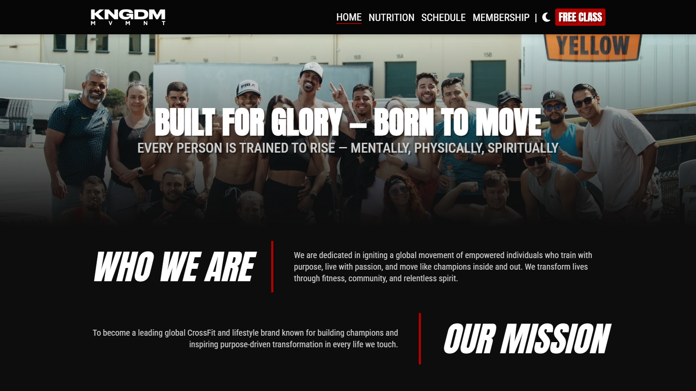
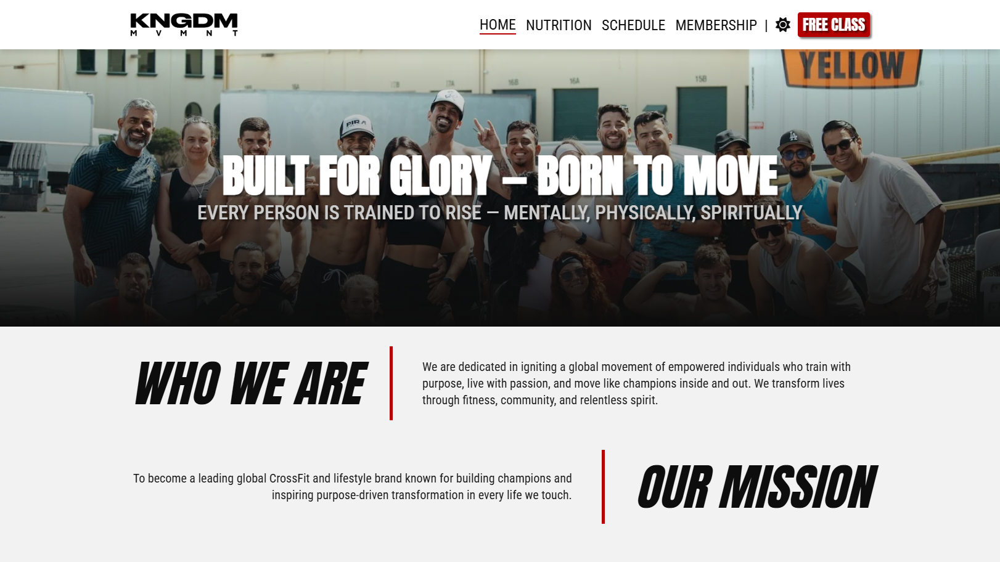
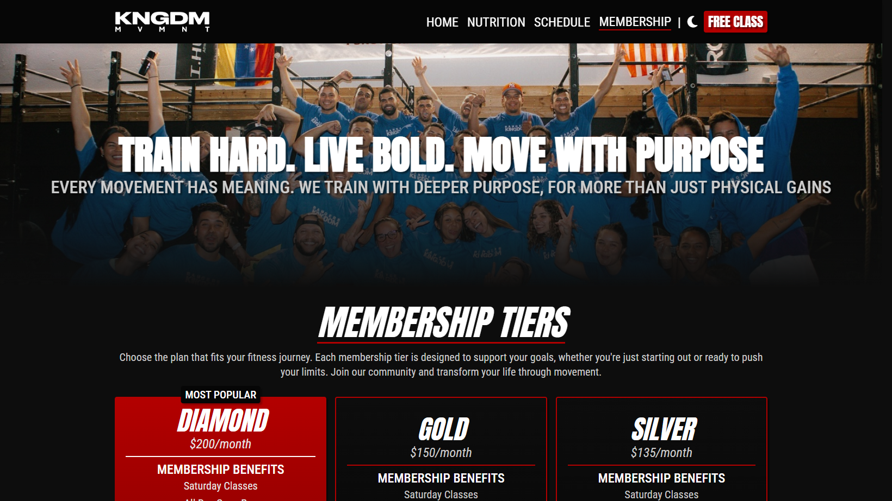
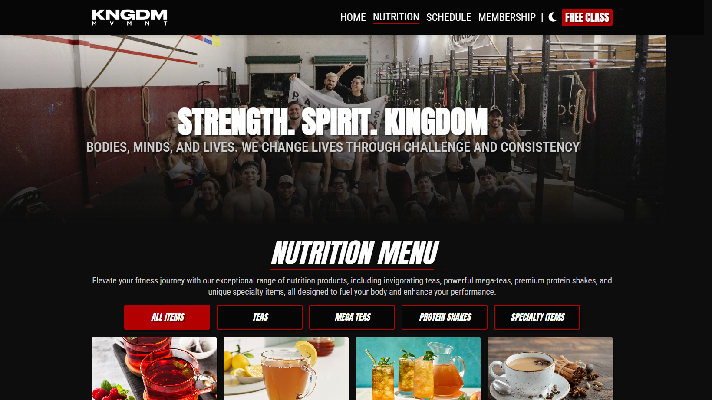
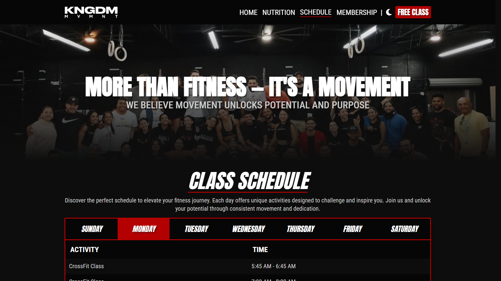

# Kingdom Movement

## Description

Kingdom Movement is a modern, high-performance CrossFit and fitness training website built with Next.js. The platform serves as a comprehensive informational hub for a CrossFit studio, featuring detailed information about nutrition offerings, class schedules, membership tiers, and expert coaching services.

- **Problem:** Fitness enthusiasts need an accessible, fast, and informative platform to learn about gym services, schedules, and membership options before committing to a fitness program. The website solves this by providing comprehensive information in an optimized, user-friendly format.

- **Solution:** This application provides a seamless, SEO-optimized web experience that showcases Kingdom Movement&apos;s fitness programs, nutrition services, and community offerings. It enables potential members to explore membership options, view class schedules, browse nutrition menus, and connect with the gym.

- **Methodology:** Built using Next.js App Router architecture with component-based design. The application leverages server-side rendering and static generation for optimal performance and SEO. Client-side interactivity is handled through React hooks and state management for dynamic features like category filtering, schedule navigation, and theme switching.

**Live Demo:** [Link to Deployed Application]([Link])

## Table of Contents

- [Features](#features)
- [Mock Up](#mock-up)
- [Technology Stack](#technology-stack)

## Features

- **Responsive Design:** Fully responsive layout optimized for desktop, tablet, and mobile devices. Adaptive navigation with mobile sidebar menu and sticky header functionality.

- **Expert Coach Profiles:** Interactive carousel showcasing expert trainers with detailed profiles, images, and descriptions. Auto-rotating carousel with manual navigation controls.

- **Dark/Light Theme Toggle:** Persistent theme switching with system preference detection. Theme preferences are saved to localStorage for consistent user experience across sessions.

- **Interactive Class Schedule:** View weekly class schedules with day-by-day navigation. The schedule displays activities, times, and handles closed days with user-friendly messaging.

- **Comprehensive Nutrition Menu:** Browse over 30+ nutrition items with category filtering. Each item includes detailed descriptions, images, and customization options (add-ons, extras, premium flavors).

- **Membership Tier Selection:** Explore multiple membership options with detailed benefits, pricing, and sign-up links. Features include popular tier highlighting and comprehensive additional information sections.

## Mock Up

The following images demonstrate the web application&apos;s appearance and functionality:

## Technology Stack

**Frontend:**

- **UI Library:** React 19.2.3
- **Framework:** Next.js 16.1.1 (App Router)
- **Image Optimization:** Next.js Image component
- **Styling:** CSS Modules with CSS Variables for theming
- **State Management:** React Hooks (useState, useEffect, useRef)
- **Font Optimization:** Next.js Font Optimization (Anton, Bebas Neue, Roboto Condensed)

**Backend:**

- **Runtime:** Node.js
- **Framework:** Next.js (Server-Side Rendering & Static Generation)

**Other Technologies:**

- **Version Control:** Git
- **Build Tool:** Next.js built-in bundler
- **Code Quality:** ESLint with Next.js configuration
- **Data Storage:** JSON files for static data (coaches, nutrition, schedule, membership)

---
